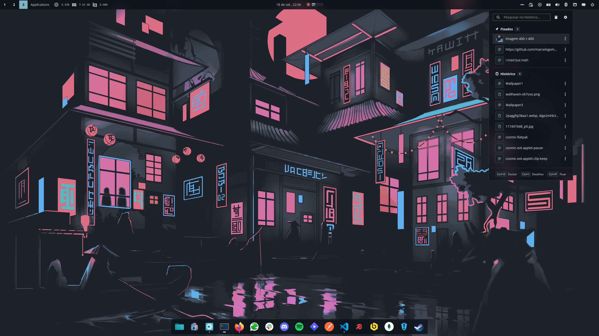

<div align="center">


# Clip Keep

A clipboard history applet for the [COSMIC](https://system76.com/cosmic) desktop, holding
everything you copied one click away.

</div>

The panel shows one button. Clicking it opens a searchable list of what you have copied — text,
files, and images — with the entries you pinned kept above the rest. Pick one and it goes back on
the clipboard, ready to paste.



## Features

- Records text, file, and image selections, and puts any of them back on the clipboard with one
  click.
- Keeps the formatting a copy came with. A snippet taken from a document or a page is stored with
  its rich flavours beside the plain text, and every entry is offered back under each name a
  destination might ask for, so the window you paste into picks what suits it — the styled version
  in a word processor, plain text in a terminal.
- Opens from anywhere with **Super+V**, on the monitor holding the window you were just using, and
  accepts typing and keyboard actions immediately without a preparatory click. Clicking outside
  dismisses it. The shortcut registers itself the first time Clip Keep runs, and never claims the
  combination if something else already answers it.
- Drives the list from the keyboard: the arrows walk it and scroll to follow, Enter copies and
  closes, and Ctrl+I, Ctrl+P, Ctrl+D and Ctrl+F open details, pin, delete, and go back to the search.
  A strip along the bottom keeps those shortcuts in view without hunting for them.
- Pastes into the window you came from when you pick an entry. Off by default, and nothing is typed
  when you dismiss the list instead.
- Filters the list as you type, matching case-insensitively anywhere in an entry, so a few letters
  from the middle of a snippet are enough to find it.
- Pins the entries you keep reaching for. Pinned entries sit in their own section and are never
  removed by the entry limit, the age limit, or **Clear history**.
- Shows image entries as thumbnails, small, medium, or large as you prefer, and never loads a full
  body into the list.
- Opens a details page from each row's menu or Ctrl+I, with more of the text and where it came from,
  when it was first copied and last used, how many times, how big it is, and which formats it holds.
  Escape returns from details or settings to the list before it closes the popup.
- Keeps each row to one line: a badge for what it holds, the entry itself, and a menu holding
  details, pin, and delete.
- Takes the icons the desktop already has a word for — settings, delete, the row menu — from the
  icon theme so the applet matches everything else on the panel, and compiles in its own glyphs for
  the rest, which no theme ships. Every colour comes from the COSMIC theme in use.
- Discards entries an application marked as a password, honouring the
  `x-kde-passwordManagerHint` convention that password managers already publish.
- Pauses recording entirely in private mode, which the panel button shows at a glance.
- Keeps the history to a size and an age you choose, and stores it in a database only you can
  read.
- Runs one instance per monitor, as COSMIC panels do, and keeps every list in step with the
  others.
- Follows the panel's anchor, size, and theme, and shrinks the popup to whatever it is showing.
- Never reaches the network, and reads nothing outside its own history.

## Installation

### Flatpak

```sh
flatpak remote-add --if-not-exists --user cosmic https://apt.pop-os.org/cosmic/cosmic.flatpakrepo
flatpak install --user cosmic io.github.marcelogomes90.cosmic-ext-applet-clip-keep
```

### From source

Needs a Rust toolchain and the COSMIC development dependencies.

```sh
just build-release
just install-user      # ~/.local, no root
# or
sudo just install      # /usr
```

Then add **Clip Keep** in Settings → Desktop → Panel → Applets.

## Contributing

[ARCHITECTURE.md](ARCHITECTURE.md) explains how the capture backend and the applet fit together,
which Wayland connection each half uses, and what each Flatpak permission is for. Read it before
moving code across the `src/clip` boundary or changing the manifest.

```sh
just verify   # fmt, clippy -D warnings, layering, tests, and metadata validation
just run-dump # headless: watch the live clipboard without the applet
```

### Packaging

The submission payload for [pop-os/cosmic-flatpak](https://github.com/pop-os/cosmic-flatpak) is
the two tracked files under
`flatpak/io.github.marcelogomes90.cosmic-ext-applet-clip-keep/`: the manifest and
`cargo-sources.json`. Regenerate the vendored source list whenever `Cargo.lock` gains a package:

```sh
just flatpak-sources
just flatpak-build-local   # builds the working tree, no tag required
```

`just flatpak-build` builds the manifest as submitted, from the tag it names, so publish the
release tag before running it.

### Translating

Translations are [Fluent](https://projectfluent.org) catalogues under `i18n/<locale>/clip-keep.ftl`.
To add a language, copy `i18n/en/clip-keep.ftl` into a new locale directory and translate the
values — the keys must stay as they are. One test asserts every catalogue carries exactly the same
keys as the English one and another renders a plural from each, so a drifting or malformed
translation fails the build rather than shipping as a blank label.

## Licence

GPL-3.0-only. See [LICENSE](LICENSE).
