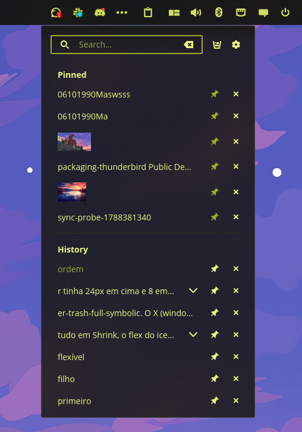

<div align="center">


# Clip Keep

A clipboard history applet for the [COSMIC](https://system76.com/cosmic) desktop, holding
everything you copied one click away.

</div>

The panel shows one button. Clicking it opens a searchable list of what you have copied — text,
files, and images — with the entries you pinned kept above the rest. Pick one and it goes back on
the clipboard, ready to paste.



## Features

- Records text, file, and image selections, and puts any of them back on the clipboard with one
  click.
- Filters the list as you type, matching case-insensitively anywhere in an entry, so a few letters
  from the middle of a snippet are enough to find it.
- Pins the entries you keep reaching for. Pinned entries sit in their own section and are never
  removed by the entry limit, the age limit, or **Clear history**.
- Shows image entries as thumbnails, and never loads a full body into the list.
- Opens a card beside the popup when you rest on a row, with more of the text and where it came
  from, when it was first copied and last used, how many times, and how big it is.
- Keeps each row uncluttered: pin and delete appear only on the row under the pointer.
- Discards entries an application marked as a password, honouring the
  `x-kde-passwordManagerHint` convention that password managers already publish.
- Pauses recording entirely in private mode, which the panel button shows at a glance.
- Keeps the history to a size and an age you choose, and stores it in a database only you can
  read.
- Runs one instance per monitor, as COSMIC panels do, and keeps every list in step with the
  others.
- Follows the panel's anchor, size, and theme, and shrinks the popup to whatever it is showing.
- Never reaches the network, and reads nothing outside its own history.

## Installation

### Flatpak

```sh
flatpak remote-add --if-not-exists --user cosmic https://apt.pop-os.org/cosmic/cosmic.flatpakrepo
flatpak install --user cosmic io.github.marcelogomes90.cosmic-ext-applet-clip-keep
```

### From source

Needs a Rust toolchain and the COSMIC development dependencies.

```sh
just build-release
just install-user      # ~/.local, no root
# or
sudo just install      # /usr
```

Then add **Clip Keep** in Settings → Desktop → Panel → Applets.

## Contributing

[ARCHITECTURE.md](ARCHITECTURE.md) explains how the capture backend and the applet fit together,
why the capture thread must never touch the socket the panel hands over, and what each Flatpak
permission is for. Read it before moving code across the `src/clip` boundary or changing the
manifest.

```sh
just verify   # fmt, clippy -D warnings, layering, tests, and metadata validation
just run-dump # headless: watch the live clipboard without the applet
```

### Packaging

The submission payload for [pop-os/cosmic-flatpak](https://github.com/pop-os/cosmic-flatpak) is
the two tracked files under
`flatpak/io.github.marcelogomes90.cosmic-ext-applet-clip-keep/`: the manifest and
`cargo-sources.json`. Regenerate the vendored source list whenever `Cargo.lock` gains a package:

```sh
just flatpak-sources
just flatpak-build-local   # builds the working tree, no tag required
```

`just flatpak-build` builds the manifest as submitted, from the tag it names, so publish the
release tag before running it.

### Translating

Translations are [Fluent](https://projectfluent.org) catalogues under `i18n/<locale>/clip-keep.ftl`.
To add a language, copy `i18n/en/clip-keep.ftl` into a new locale directory and translate the
values — the keys must stay as they are. One test asserts every catalogue carries exactly the same
keys as the English one and another renders a plural from each, so a drifting or malformed
translation fails the build rather than shipping as a blank label.

## Licence

GPL-3.0-only. See [LICENSE](LICENSE).
